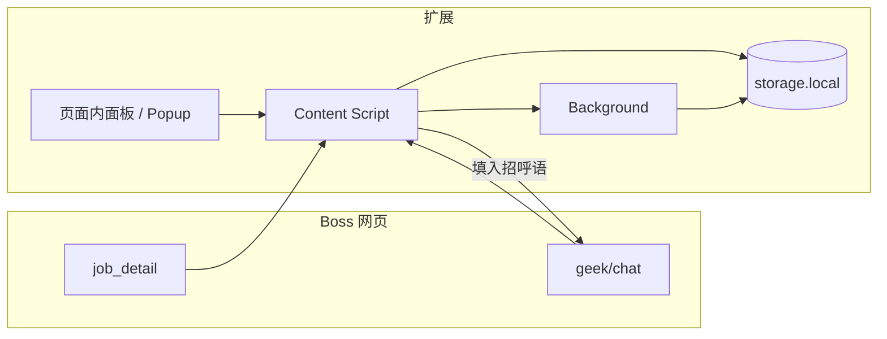

# Boss JD Copilot — AI 项目规范

> 本文档供 Cursor / Agent 快速理解产品目标、技术约束与实现约定。修改架构或业务边界时请同步更新。

## 1. 产品是什么

**Boss JD Copilot** 是一款面向**求职者**的 Chrome 浏览器扩展（Boss 直聘场景）。

| 维度 | 说明 |
|------|------|
| 核心问题 | 不同岗位的 JD 要求不同，通用招呼语显得敷衍；求职者需要针对岗位调整措辞，但重复撰写耗时 |
| 核心价值 | 在不离开当前 Boss 页面的前提下，基于当前职位 JD 用 AI 生成**个性化招呼语**，便于快速发给 HR |
| 目标用户 | 求职者（geek 端），不是招聘方 |
| 非目标 | 不做批量爬取、不做违背平台规则的自动化投递；不覆盖 Boss 列表页的「预定招呼语」流程 |

## 2. Boss 直聘网页端的现实约束（必读）

以下来自实际调研，**实现方案必须服从这些约束**，不要假设「全站都能拿到完整 JD」。

### 2.1 仅支持的三个页面

| 页面 | URL 模式 | 数据能力 | 产品角色 |
|------|----------|----------|----------|
| 职位详情 | `https://www.zhipin.com/job_detail*` | 可获取**完整 JD**（DOM） | 采集 JD → 调用 AI → **缓存**招呼语与上下文 |
| 推荐列表 | `https://www.zhipin.com/web/geek/jobs*` | 左列表 + 右详情面板，右侧含**完整 JD**（DOM） | 同上；用户在左列表点选不同卡片时右侧 DOM 会替换 |
| 沟通聊天 | `https://www.zhipin.com/web/geek/chat*` | 页面上通常只有**职位名称**等有限信息 | 按会话匹配缓存 → **填入**招呼语到输入框 |

不注入其它 Boss 页面（个人中心、消息中心、企业页 `gongsi/*` 等）。曾以为"列表页只能发预定招呼语"，实际 `/web/geek/jobs*` 的右侧详情面板与详情页同源，可直接抽 JD；DOM 选择器见 [lib/boss/dom-job-detail.ts](lib/boss/dom-job-detail.ts) 顶部 `SELECTORS`。

### 2.2 反爬与调试

- Boss 网页端有反爬/反调试（如难以使用站点内 F12）。
- **优先策略：读已渲染 DOM**，不将逆向接口作为第一方案。
- 调试应走扩展通道：`chrome.runtime.sendMessage`、Service Worker 控制台、`chrome://extensions`，或 popup 探针；**不要假设**能在 zhipin.com 页面里安全使用 `console.log`。
- 可选进阶：MAIN world 注入 hook `fetch`（维护成本高，Boss 改版易失效）。

### 2.3 推荐用户动线

```text
job_detail（读 JD → AI 生成 → 写入 chrome.storage.local）
    ↓
web/geek/chat（读当前会话职位名 → 匹配缓存 → 填入输入框）
```

聊天页**不应**承担「补全完整 JD」的职责；JD 以详情页为准。匹配 key 建议：`jobId`（若 URL 有）或 `职位名 + 公司名` 的稳定组合。

## 3. 技术栈与仓库结构

| 项 | 选型 |
|----|------|
| 框架 | [Plasmo](https://docs.plasmo.com/) 0.90.x |
| 平台 | Chrome Manifest V3 |
| UI | React 18 + TypeScript |
| 包管理 | pnpm |
| 权限 | `host_permissions`: `https://*/*`（`package.json` → `manifest`） |

### 3.1 Plasmo 约定（文件即能力）

| 文件 / 目录 | 作用 |
|-------------|------|
| `popup.tsx` 或 `popup/index.tsx` | 扩展图标弹窗（设置、状态、调试探针） |
| `options.tsx` 或 `options/index.tsx` | 选项页（**API Key**、模型配置等敏感信息放这里）。当前已折叠为 `options/`，子组件同目录 |
| `content.ts` 或 `contents/*.tsx` | 注入 Boss 页面的 Content Script（**核心业务**） |
| `background.ts` 或 `background/index.ts` | Service Worker：AI 请求、跨页消息、storage 编排 |
| `build/chrome-mv3-dev` | `pnpm dev` 开发构建产物，Chrome「加载已解压的扩展程序」选此目录 |
| `build/chrome-mv3-prod` | `pnpm build` 生产构建 |

> Plasmo 入口的"文件夹形式"（`xxx/index.tsx` + 同目录子组件）等价于单文件形式。
> 入口长到 ~200 行或将频繁改动时折叠成文件夹；子组件**只在该入口私用**，跨入口共享的 UI 走 `lib/ui/`。

新增 Content Script 的 `matches` 变更后，需在 `chrome://extensions` **刷新扩展**（manifest 才会更新）。

### 3.2 项目目录结构（权威，AI 新建文件必遵）

> Cursor 会话中 `.cursor/rules/boss-jd-copilot.mdc`（`alwaysApply: true`）与本节同步；**新增文件前查落点表**。

```text
boss-jd-copilot/
├── popup.tsx                 # 扩展弹窗入口（薄）
├── options/                  # 选项页：API Key、模型配置（已折叠为文件夹）
│   ├── index.tsx             #   入口：state + save
│   ├── ui.tsx                #   Section/Field 包装 + 样式字典
│   ├── ProviderSection.tsx   #   provider 预设 + baseURL + key + model
│   ├── ProfileSection.tsx    #   自我介绍：textarea + PDF 上传（解析完直接覆盖 textarea）
│   └── GreetingSection.tsx   #   tone 预设 + 可折叠的"自定义系统 prompt"编辑器
├── background.ts             # Service Worker：消息、AI、storage 编排
├── content.ts                # Content Script 入口：matches、调度 lib
├── contents/
│   └── boss-panel.tsx        # 页面内 React 浮层（Plasmo CS UI）
├── lib/                      # 所有业务逻辑（默认在这里新建）
│   ├── boss/
│   │   ├── pages.ts          # URL → job_detail | chat | unknown
│   │   ├── dom-job-detail.ts # 详情页 DOM 抽取
│   │   ├── dom-chat.ts       # 聊天页 DOM 读取 + 填入输入框
│   │   └── probe.ts          # DOM 探针（绕过 Boss 反调试，浮层里实时拾取选择器）
│   ├── storage/
│   │   ├── keys.ts           # storage key 常量
│   │   ├── options.ts        # AiSettings 类型 + provider 预设 + 读写
│   │   └── job-cache.ts      # JD + 招呼语缓存读写
│   ├── ai/
│   │   ├── client.ts         # chatCompletion：通用 OpenAI 兼容 fetch
│   │   ├── prompts.ts        # 招呼语 prompt：PRESET_PROMPTS + customPrompt 覆盖
│   │   └── resume-prompt.ts  # 简历 → 个人画像 的分析 prompt
│   ├── pdf.ts                # PDF 文本抽取（pdfjs-dist；在 options 页执行）
│   ├── messages.ts           # chrome.runtime 消息类型
│   └── debug.ts              # 调试信息上报 background
├── assets/                   # 图标等静态资源
├── AGENTS.md
├── .cursor/rules/            # Cursor 始终生效规则
├── build/                    # pnpm dev/build 输出 — 禁止手改、禁止新建源码
└── .plasmo/                  # Plasmo 缓存 — 禁止手改
```

#### 新建文件落点表

| 要写的内容 | 创建位置 | 不要放在 |
|------------|----------|----------|
| Plasmo 扩展能力入口 | 根目录单文件（`popup.tsx` / `background.ts` / `content.ts`）或同名文件夹 + `index`（如 `options/index.tsx`） | `lib/`、`build/` |
| Boss 页内嵌 UI | `contents/*.tsx` | 根目录长篇 React |
| 页面类型 / URL 判断 | `lib/boss/pages.ts` | `content.ts` 内联一长段 |
| 职位详情 DOM、JD 抽取 | `lib/boss/dom-job-detail.ts` | popup、background |
| 聊天页 DOM、填入招呼语 | `lib/boss/dom-chat.ts` | popup、background |
| 调试 / 找选择器（Boss 不让开 F12） | `lib/boss/probe.ts` + 浮层探针按钮 | 依赖 Boss 控制台 |
| `chrome.storage.local` | `lib/storage/` | content 内硬编码 key |
| 扩展内消息协议 | `lib/messages.ts` | 多处重复 type |
| 大模型 HTTP、prompt 文案 | `lib/ai/`（由 `background.ts` 调用） | **禁止** content / popup |
| PDF / DOCX 等文件解析 | `lib/pdf.ts`（在 options 页执行，纯文本送 background） | background（SW 没 DOM） |
| 共享 React 片段 | `lib/ui/`（按需创建） | popup 与 contents 各复制一份 |
| 产品/结构文档 | `AGENTS.md`、`.cursor/rules/*.mdc` | `README` 代替 AGENTS |

#### 入口文件职责（保持「薄」）

| 文件 | 只做 | 委托给 |
|------|------|--------|
| `content.ts` | `PlasmoCSConfig.matches`、初始化、`getPageType` 分发 | `lib/boss/*`、`contents/*` |
| `background.ts` | `onMessage`、调 AI、写 storage | `lib/ai/*`、`lib/storage/*` |
| `popup.tsx` | 状态展示、打开 options、开发探针 | `lib/*` |
| `options.tsx` | 表单持久化配置 | `lib/storage/*` |

路径别名：`import { ... } from "~lib/boss/pages"`（`tsconfig.json` → `~*` 指向项目根）。

**禁止**：在 `build/`、`.plasmo/` 下创建或修改业务代码；为 Boss 列表页或其它 URL 新建 content script。

## 4. 架构原则



- **Content Script**：页面识别、DOM 读取、UI 浮层、填入输入框。
- **Background**：调用大模型 API；勿在 content script 内嵌 API Key。
- **Storage**：详情页写入的 JD + 生成的招呼语；聊天页只读匹配。
- **Popup**：配置、手动触发、开发期 DOM 探针；主流程尽量在页面内完成（「不离开当前页」）。

## 5. 实现优先级（未完成任务参考）

1. ~~`content.ts`：仅匹配 `job_detail*` 与 `web/geek/chat*`。~~（已有骨架，见 `content.ts` + `lib/boss/pages.ts`）
2. 详情页：`MutationObserver` 等待 SPA 渲染后抽取 JD，写入 storage（`lib/boss/dom-job-detail.ts`）。
3. 聊天页：读当前会话职位名，匹配 storage，填入输入框。
4. Background：AI 生成招呼语（prompt 需包含 JD 摘要 + 求职者可调语气占位）。
5. `options.tsx`：API Key / 模型 endpoint。
6. 页面内轻量 UI（Plasmo CS UI），而非仅依赖 popup。

## 6. 编码与协作约定

- **最小改动**：只改与当前任务相关的文件；不扩 scope 到列表页或其它站点。
- **遵循现有风格**：Prettier、`@ianvs/prettier-plugin-sort-imports`；路径别名 `~*` → 项目根。
- **注释**：只解释 Boss 业务或非显而易见的 DOM/SPA 行为。
- **安全**：密钥仅存在于 options + background；不向 content script 暴露；用户数据默认 `chrome.storage.local`，不上传未声明的第三方。
- **合规表述**：招呼语是「辅助生成」，由用户确认后发送；避免全自动批量消息。
- **测试**：不添加无意义的占位测试；Boss DOM 相关逻辑以可手动在详情页/聊天页验证为准。
- **Git**：仅在用户明确要求时 commit；不 force push main。

## 7. 本地开发速查

```bash
pnpm dev      # 监听构建 → build/chrome-mv3-dev
pnpm build    # 生产包 → build/chrome-mv3-prod
pnpm package  # 打 zip 用于商店
```

Chrome：`chrome://extensions` → 开发者模式 → 加载已解压的扩展程序 → 选择 `build/chrome-mv3-dev`。

## 8. 对 AI 的常见请求应如何响应

| 用户意图 | 应做 |
|----------|------|
| 「识别 Boss 页面」 | 仅处理 `job_detail` / `web/geek/chat` 两路径 |
| 「拿 JD」 | 详情页 DOM；聊天页用 storage 匹配，不幻想接口 |
| 「生成招呼语」 | background + options 配置；prompt 体现岗位差异 |
| 「不离开页面」 | Content Script UI + 填入聊天框，popup 为辅 |
| 「打不开控制台」 | 用扩展调试通道，不用依赖站点 F12 |

## 9. 文档维护

- 产品边界、Boss 页面策略、存储 key 约定变更 → 更新 `AGENTS.md` 与 `.cursor/rules/boss-jd-copilot.mdc`。
- 新增目录或调整落点表 → 同步 §3.2 与 `.mdc` 目录树/落点表。

---

*版本：与仓库 1.0.0 对齐 · 框架 Plasmo · 面向 Chrome MV3*
